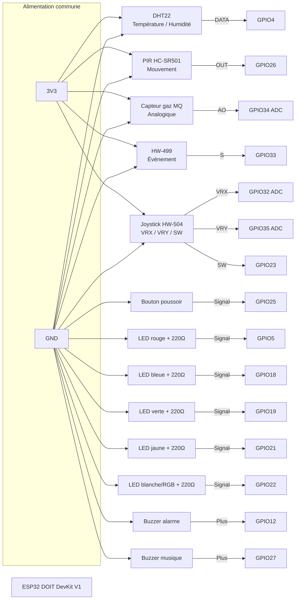
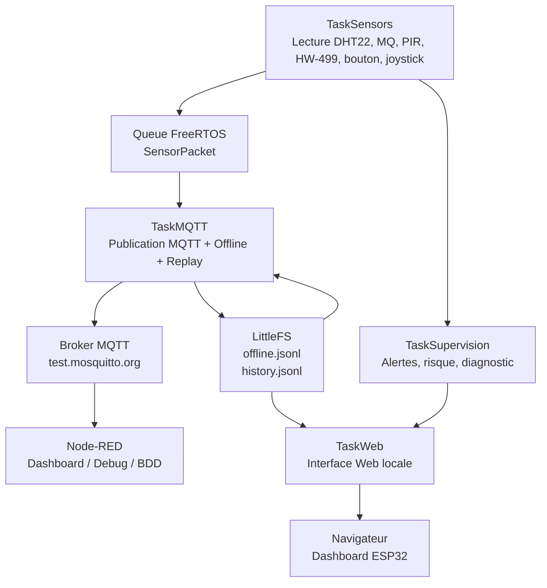
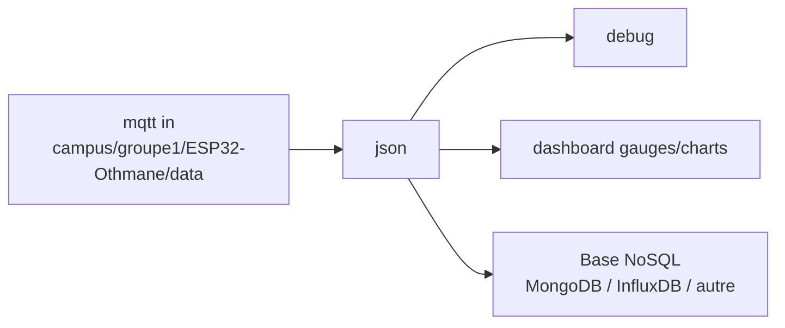
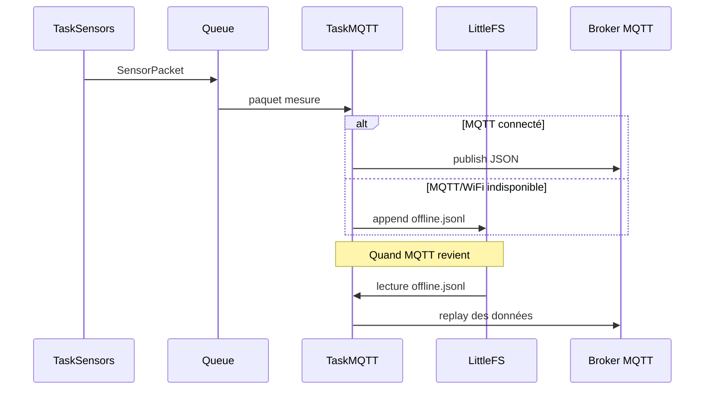

# Station IoT industrielle ESP32 — FreeRTOS, MQTT, Node-RED, Offline & Supervision

Projet réalisé dans le cadre de la mission IoT : conception d’une station connectée industrielle robuste, maintenable et capable de continuer à fonctionner même en cas de panne réseau.

La station utilise un **ESP32 DOIT DevKit V1**, plusieurs capteurs, une interface Web embarquée, MQTT, Node-RED, une base locale LittleFS, des tâches FreeRTOS, un mode offline/replay, une page de supervision CPU et une page de jeux contrôlés par joystick.

---

## Sommaire

- [Objectif du projet](#objectif-du-projet)
- [Fonctionnalités principales](#fonctionnalités-principales)
- [Matériel utilisé](#matériel-utilisé)
- [Schéma de branchement](#schéma-de-branchement)
- [Tableau des branchements](#tableau-des-branchements)
- [Architecture logicielle](#architecture-logicielle)
- [Tâches FreeRTOS et priorités](#tâches-freertos-et-priorités)
- [MQTT et Node-RED](#mqtt-et-node-red)
- [Mode offline et replay](#mode-offline-et-replay)
- [Base de données locale](#base-de-données-locale)
- [Sécurité](#sécurité)
- [Interface Web](#interface-web)
- [Jeux joystick HW-504](#jeux-joystick-hw-504)
- [Installation PlatformIO](#installation-platformio)
- [Tests recommandés](#tests-recommandés)
- [Dépannage](#dépannage)
- [Ce qu’il faut expliquer à la soutenance](#ce-quil-faut-expliquer-à-la-soutenance)

---

## Objectif du projet

Le but est de créer une station IoT industrielle capable de :

- lire des capteurs en continu ;
- publier les mesures en MQTT ;
- afficher les mesures sur une interface Web locale ;
- fonctionner sans blocage grâce à FreeRTOS ;
- conserver les données quand le WiFi ou MQTT tombe ;
- rejouer les données stockées quand le réseau revient ;
- superviser l’état du système ;
- détecter des pannes capteur ;
- être expliquée facilement à l’oral.

Le projet respecte l’idée principale de la mission :

```text
TaskSensors → Queue → TaskMQTT → Broker MQTT → Node-RED → Base NoSQL
                         │
                         ├── TaskWeb
                         └── TaskSupervision
```

---

## Fonctionnalités principales

### Capteurs

- DHT22 : température et humidité.
- PIR HC-SR501 : détection de mouvement.
- Capteur gaz MQ : mesure analogique de gaz.
- HW-499 : détection d’événement / inclinaison selon le module.
- Joystick HW-504 : contrôle des jeux sur la page Web.
- Bouton physique : sécurité / acquittement alarme.

### Actionneurs

- LED rouge : danger.
- LED bleue : état normal.
- LED verte : WiFi / système OK.
- LED jaune : alerte modérée.
- LED blanche ou RGB simple : mode sécurité / information.
- Buzzer alarme.
- Buzzer musique.

### Logiciel

- FreeRTOS avec plusieurs tâches séparées.
- `loop()` vide.
- Aucun `delay()` classique.
- Utilisation de `vTaskDelay()`.
- Queue FreeRTOS entre capteurs et MQTT.
- Mutex uniquement pour les ressources partagées.
- MQTT via `PubSubClient`.
- Serveur Web local via `ESPAsyncWebServer`.
- LittleFS pour base locale.
- Offline/replay.
- Supervision heap, uptime, WiFi, MQTT, latence.
- Page jeux avec joystick.
- Page supervision CPU double cœur.
- Interface claire, classique et lisible.

---

## Matériel utilisé

| Composant | Rôle |
|---|---|
| ESP32 DOIT DevKit V1 | Microcontrôleur principal |
| DHT22 | Température + humidité |
| PIR HC-SR501 | Détection de mouvement |
| Capteur MQ gaz | Détection gaz analogique |
| HW-499 | Détection événement / inclinaison |
| HW-504 joystick | Contrôle des jeux Web |
| Bouton poussoir | Sécurité / acquittement |
| LED rouge | Danger |
| LED bleue | Normal |
| LED verte | WiFi OK |
| LED jaune | Warning |
| LED blanche ou RGB | Information / sécurité |
| Buzzer 1 | Alarme |
| Buzzer 2 | Musiques / feedback |
| Résistances 220 Ω ou 330 Ω | Protection LEDs |

---

## Schéma de branchement

Schéma logique compatible GitHub Mermaid :



---

## Tableau des branchements

### Capteurs

| Élément | Broche module | ESP32 | Remarque |
|---|---:|---:|---|
| DHT22 | VCC | 3V3 | Alimentation |
| DHT22 | GND | GND | Masse commune |
| DHT22 | DATA | GPIO4 | Température / humidité |
| PIR HC-SR501 | VCC | 3V3 | Version 3V3 demandée |
| PIR HC-SR501 | GND | GND | Masse commune |
| PIR HC-SR501 | OUT | GPIO26 | Détection mouvement |
| MQ gaz | VCC | 3V3 | AO direct si module alimenté en 3V3 |
| MQ gaz | GND | GND | Masse commune |
| MQ gaz | AO | GPIO34 | Entrée analogique ADC |
| HW-499 | + | 3V3 | Alimentation |
| HW-499 | - | GND | Masse commune |
| HW-499 | S | GPIO33 | Signal numérique |
| Joystick HW-504 | VCC | 3V3 | Alimentation |
| Joystick HW-504 | GND | GND | Masse commune |
| Joystick HW-504 | VRX | GPIO32 | Axe X analogique |
| Joystick HW-504 | VRY | GPIO35 | Axe Y analogique |
| Joystick HW-504 | SW | GPIO23 | Bouton joystick |
| Bouton poussoir | 1 patte | GPIO25 | Entrée `INPUT_PULLUP` |
| Bouton poussoir | autre patte | GND | Appui = LOW |

### Actionneurs

| Élément | ESP32 | Branchement |
|---|---:|---|
| LED rouge | GPIO5 | GPIO → résistance 220 Ω → LED → GND |
| LED bleue | GPIO18 | GPIO → résistance 220 Ω → LED → GND |
| LED verte | GPIO19 | GPIO → résistance 220 Ω → LED → GND |
| LED jaune | GPIO21 | GPIO → résistance 220 Ω → LED → GND |
| LED blanche/RGB | GPIO22 | GPIO → résistance 220 Ω → LED → GND |
| Buzzer alarme | GPIO12 | GPIO12 → + buzzer, - buzzer → GND |
| Buzzer musique | GPIO27 | GPIO27 → + buzzer, - buzzer → GND |

> Important : toutes les masses doivent être communes.

> GPIO34 et GPIO35 sont des entrées uniquement. C’est adapté pour MQ AO et joystick VRY.

> Si l’ESP32 ne démarre pas correctement avec le buzzer sur GPIO12, déplacer ce buzzer vers un autre GPIO libre et modifier `BUZZER_ALARM_PIN`.

---

## Architecture logicielle



---

## Tâches FreeRTOS et priorités

| Tâche | Priorité | Cœur ESP32 | Rôle |
|---|---:|---:|---|
| `TaskSensors` | 3 | Core 1 | Acquisition capteurs, bouton, joystick, création des paquets |
| `TaskMQTT` | 2 | Core 0 | Publication MQTT, offline, replay, latence |
| `TaskSupervision` | 2 | Core 1 | Alertes, risque global, panne capteurs |
| `TaskWiFi` | 1 | Core 0 | Reconnexion WiFi |
| `TaskWeb` | 1 | Core 0 | Serveur Web asynchrone / heartbeat |
| `TaskLights` | 1 | Core 1 | LEDs et effets lumineux |
| `TaskAlarmBuzzer` | 1 ou 2 | Core 1 | Alarme sonore |
| `TaskMusicBuzzer` | 1 | Core 1 | Musiques buzzer |
| `TaskSystemLog` | 1 | Core 0 | Affichage Serial Monitor |

### Justification des priorités

- `TaskSensors` a la priorité la plus haute car l’acquisition des mesures ne doit pas être bloquée par le réseau.
- `TaskMQTT` est en priorité moyenne car la publication peut attendre quelques millisecondes.
- `TaskSupervision` surveille les alertes et l’état système.
- `TaskWeb`, `TaskWiFi`, les logs et les effets lumineux sont moins prioritaires.
- Les tâches réseau sont plutôt sur le Core 0.
- Les tâches capteurs/actionneurs sont plutôt sur le Core 1.

---

## MQTT et Node-RED

### Broker MQTT utilisé

```text
test.mosquitto.org
Port : 1883
```

### Topics

| Type | Topic |
|---|---|
| Publication données | `campus/groupe1/ESP32-Othmane/data` |
| Réception commandes | `campus/groupe1/ESP32-Othmane/cmd` |

### Exemple de message publié

```json
{
  "device": "ESP32-Othmane",
  "temp": 24.8,
  "humidity": 55.2,
  "gasRaw": 820,
  "gasPercent": 20.0,
  "pir": false,
  "hw499": false,
  "riskScore": 0,
  "riskState": "NOMINAL",
  "wifi": true,
  "mqttConnected": true,
  "heap": 198000,
  "uptime": 125
}
```

### Commandes MQTT possibles

Publier sur :

```text
campus/groupe1/ESP32-Othmane/cmd
```

Commandes :

```text
securityOn
securityOff
nightOn
nightOff
ecoOn
ecoOff
ack
light:party
light:cyber
light:scanner
music:robot
music:laugh
demo:all
demo:motion
```

---

## Node-RED

### Installation rapide

```bash
npm install -g --unsafe-perm node-red
node-red
```

Puis ouvrir :

```text
http://localhost:1880
```

### Flow minimal

```text
mqtt in → json → debug
```

Configuration du node `mqtt in` :

```text
Server : test.mosquitto.org
Port   : 1883
Topic  : campus/groupe1/ESP32-Othmane/data
QoS    : 0
```

### Flow recommandé



---

## Mode offline et replay

La station continue à lire les capteurs même si le réseau tombe.

### Cas 1 : panne MQTT

- Le WiFi reste actif.
- Le site Web reste accessible.
- Les mesures continuent à être lues.
- MQTT ne publie plus.
- Les mesures sont stockées localement.
- Quand MQTT revient, les mesures sont rejouées.

### Cas 2 : panne WiFi

- Le site Web n’est plus accessible pendant la panne.
- Les tâches FreeRTOS continuent de tourner.
- Les mesures sont conservées dans LittleFS.
- À la reconnexion, MQTT reprend.
- Les données offline sont rejouées.



---

## Base de données locale

La base locale utilise LittleFS.

| Fichier | Rôle |
|---|---|
| `/offline.jsonl` | Mesures en attente de replay MQTT |
| `/history.jsonl` | Historique des mesures pour les graphiques |
| `/events.jsonl` ou buffer RAM | Historique des événements système |

Chaque ligne est un JSON indépendant :

```json
{"ts":12345,"temp":24.8,"humidity":55.2,"gasRaw":820,"wifi":true,"mqtt":false}
```

Le format JSONL est simple à écrire, simple à lire et robuste pour un petit système embarqué.

---

## Sécurité

### Interface Web

Authentification HTTP Basic :

```text
Utilisateur : admin
Mot de passe : esp32
```

Ces valeurs peuvent être changées dans le code :

```cpp
const char* WEB_USER = "admin";
const char* WEB_PASS = "esp32";
```

### API

Les commandes sensibles utilisent un token :

```cpp
const char* API_TOKEN = "1234";
```

Le site envoie ce token automatiquement pour les actions sensibles.

---

## Interface Web

Pages disponibles :

| Page | Contenu |
|---|---|
| Dashboard | Mesures live, état global, risque |
| Graphiques | Température, humidité, gaz, timeline |
| Supervision CPU | Cœurs ESP32, heap, queues, latence |
| BDD / Offline | Fichiers LittleFS, offline, replay |
| Jeux joystick | Snake, Collecteur, Dodge |
| Réglages | MQTT, WiFi test, sécurité, seuils |

L’interface utilise Chart.js pour les graphiques.

---

## Jeux joystick HW-504

La page jeux contient plusieurs jeux simples :

| Jeu | Contrôle |
|---|---|
| Snake | Joystick ou flèches clavier |
| Collecteur | Joystick ou flèches clavier |
| Dodge | Joystick ou flèches clavier |

Le bouton du joystick sert à relancer / valider.

### Branchement joystick

```text
HW-504 VCC → 3V3
HW-504 GND → GND
HW-504 VRX → GPIO32
HW-504 VRY → GPIO35
HW-504 SW  → GPIO23
```

API associée :

```text
/api/joystick
```

Exemple :

```json
{
  "xRaw": 2048,
  "yRaw": 2048,
  "x": 0,
  "y": 0,
  "button": false,
  "buttonCount": 0,
  "direction": "CENTER"
}
```

---

## Installation PlatformIO

### 1. Cloner le projet

```bash
git clone <url-du-repo>
cd <nom-du-repo>
```

### 2. Structure attendue

```text
.
├── platformio.ini
├── README.md
└── src
    ├── main.cpp
    └── index.cpp
```

### 3. Dépendances

Dans `platformio.ini` :

```ini
[env:esp32doit-devkit-v1]
platform = espressif32
board = esp32doit-devkit-v1
framework = arduino
monitor_speed = 115200

lib_deps =
    adafruit/DHT sensor library
    adafruit/Adafruit Unified Sensor
    esp32async/AsyncTCP
    esp32async/ESPAsyncWebServer
    knolleary/PubSubClient
```

### 4. Configurer le WiFi

Dans `main.cpp`, modifier :

```cpp
const char* ssid = "NOM_WIFI";
const char* password = "MOT_DE_PASSE_WIFI";
```

### 5. Compiler et envoyer

```bash
pio run -t clean
pio run -t upload
```

### 6. Ouvrir le Serial Monitor

```bash
pio device monitor
```

Vitesse :

```text
115200
```

L’adresse IP de l’ESP32 apparaît dans le moniteur série.

---

## Tests recommandés

### Test 1 : capteurs

- Ouvrir le dashboard.
- Vérifier température/humidité.
- Vérifier gaz brut.
- Bouger devant le PIR.
- Activer HW-499.
- Bouger le joystick.

### Test 2 : MQTT

- Ouvrir Node-RED.
- Configurer `mqtt in`.
- Cliquer sur `Sauver + MQTT ON`.
- Vérifier les messages JSON dans Node-RED.

### Test 3 : panne MQTT

- Cliquer sur `Panne MQTT 5 min`.
- Vérifier que la station continue à mesurer.
- Vérifier que la base locale augmente.
- Attendre le retour MQTT.
- Vérifier le replay.

### Test 4 : panne WiFi

- Cliquer sur `Couper WiFi 1 min`.
- Le site devient inaccessible.
- La station continue à mesurer.
- Après reconnexion, l’historique affiche les mesures.

### Test 5 : panne capteur

- Débrancher le DHT22.
- Vérifier que le dashboard affiche une erreur capteur.
- Rebrancher le DHT22.
- Vérifier le retour à l’état normal.

### Test 6 : sécurité PIR

- Activer le mode sécurité.
- Passer devant le PIR.
- Vérifier alarme + intrusion.
- Cliquer sur `Acquitter`.

---

## Dépannage

### Le site ne s’ouvre pas

- Vérifier le Serial Monitor.
- Vérifier l’IP affichée.
- Vérifier que le PC/téléphone est sur le même réseau.
- Si le WiFi a été coupé depuis le site, attendre la fin de la coupure.

### MQTT reste OFF

- Cliquer sur `Sauver + MQTT ON`.
- Vérifier le broker `test.mosquitto.org`.
- Vérifier le topic Node-RED.
- Vérifier que le WiFi de l’ESP32 est connecté.

### Node-RED ne reçoit rien

Vérifier :

```text
Server : test.mosquitto.org
Port   : 1883
Topic  : campus/groupe1/ESP32-Othmane/data
```

### DHT22 en erreur

- Vérifier DATA sur GPIO4.
- Vérifier VCC 3V3.
- Vérifier GND commun.
- Attendre 2 secondes entre les lectures.

### PIR toujours actif

- Attendre la stabilisation du PIR.
- Régler les potentiomètres du module.
- Vérifier OUT sur GPIO26.

### MQ gaz incohérent

- Les capteurs MQ doivent chauffer avant stabilisation.
- Vérifier AO sur GPIO34.
- Vérifier l’alimentation 3V3.
- Utiliser le bouton `Calibrer gaz`.

### ESP32 ne démarre pas

- Débrancher le buzzer sur GPIO12.
- Si le problème disparaît, déplacer ce buzzer sur un autre GPIO et modifier le code.

---

## Ce qu’il faut expliquer à la soutenance

### Rôle des tâches

- `TaskSensors` lit les capteurs et crée des paquets de mesure.
- `TaskMQTT` publie les mesures et gère offline/replay.
- `TaskWeb` expose l’interface locale.
- `TaskSupervision` vérifie l’état global, les alertes et la santé système.

### Pourquoi une Queue ?

La Queue découple l’acquisition capteur de la publication réseau.

Si MQTT est lent ou indisponible, les capteurs continuent à travailler. Cela évite de perdre des mesures et évite de bloquer l’acquisition.

### Pourquoi un Mutex ?

Le mutex protège uniquement les ressources partagées :

- mesures affichées par le Web ;
- état système ;
- historique événements ;
- compteurs de supervision.

### Que se passe-t-il si le WiFi tombe ?

- La station continue à lire les capteurs.
- Les données sont stockées localement.
- Le site Web devient inaccessible pendant la coupure WiFi.
- Quand le WiFi revient, MQTT se reconnecte.
- Les données stockées sont rejouées.

### Trajet complet d’une mesure

```text
DHT22
→ TaskSensors
→ SensorPacket
→ Queue FreeRTOS
→ TaskMQTT
→ Broker MQTT
→ Node-RED
→ Dashboard / Base NoSQL
```

### Limites actuelles

- La base locale LittleFS reste limitée par la mémoire flash disponible.
- L’heure exacte vient du navigateur ou de l’uptime ESP32, pas d’un module RTC.
- MQTT public `test.mosquitto.org` est pratique pour la démo, mais un broker privé serait préférable en production.
- Les identifiants Web doivent être changés avant un vrai déploiement.

---

## Auteur

Projet réalisé par **Othmane Baltache**.

Master Informatique — Mission IoT ESP32 / FreeRTOS / MQTT / Node-RED.
