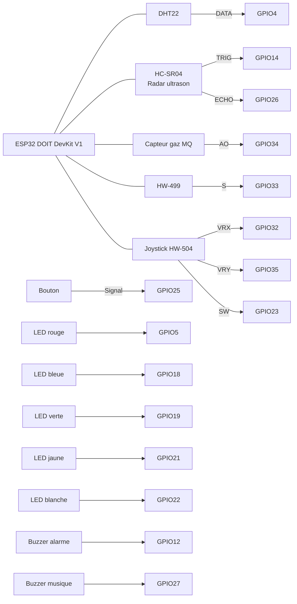
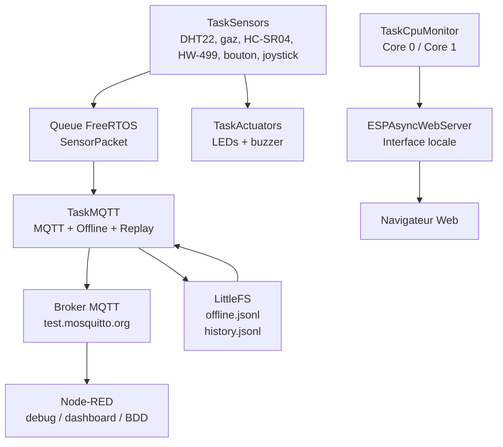
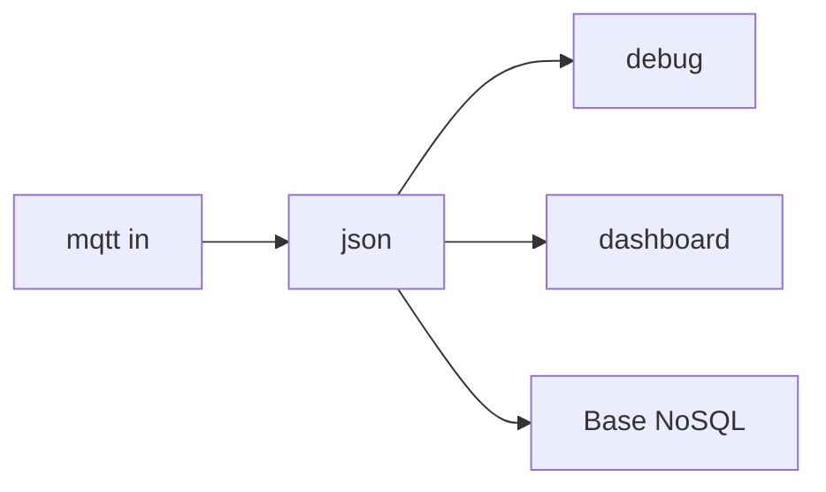

# Station IoT ESP32 — FreeRTOS, MQTT, Radar HC-SR04, Offline & Supervision

Projet IoT réalisé avec un **ESP32 DOIT DevKit V1**.  
La station connectée mesure l’environnement, détecte des objets avec un radar ultrason **HC-SR04**, publie les données en MQTT, conserve les mesures en cas de panne réseau et propose une interface Web locale simple et fonctionnelle.

Le projet est conçu pour répondre à une architecture industrielle robuste :

```text
Capteurs
  ↓
TaskSensors
  ↓
Queue FreeRTOS
  ↓
TaskMQTT
  ↓
Broker MQTT
  ↓
Node-RED / Base NoSQL
```

---

## Sommaire

- [Objectif du projet](#objectif-du-projet)
- [Fonctionnalités principales](#fonctionnalités-principales)
- [Matériel utilisé](#matériel-utilisé)
- [Branchement final](#branchement-final)
- [Architecture logicielle](#architecture-logicielle)
- [Répartition FreeRTOS](#répartition-freertos)
- [Radar HC-SR04](#radar-hc-sr04)
- [MQTT et Node-RED](#mqtt-et-node-red)
- [Mode offline et replay](#mode-offline-et-replay)
- [Interface Web](#interface-web)
- [Jeux joystick](#jeux-joystick)
- [Installation PlatformIO](#installation-platformio)
- [Tests recommandés](#tests-recommandés)
- [Dépannage](#dépannage)
- [À expliquer à la soutenance](#à-expliquer-à-la-soutenance)
- [Auteurs](#auteurs)

---

## Objectif du projet

L’objectif est de concevoir une station IoT capable de :

- lire plusieurs capteurs ;
- détecter un objet ou une intrusion avec un **HC-SR04** ;
- afficher les données sur un site Web embarqué dans l’ESP32 ;
- publier les mesures vers un broker MQTT ;
- fonctionner même si MQTT ou WiFi tombe ;
- stocker les mesures localement en mode offline ;
- rejouer les données quand le réseau revient ;
- superviser l’état du système ;
- répartir les tâches sur les deux cœurs de l’ESP32 ;
- garder un `loop()` vide grâce à FreeRTOS.

---

## Fonctionnalités principales

### Capteurs

| Capteur | Rôle |
|---|---|
| DHT22 | Température et humidité |
| HC-SR04 | Radar ultrason / distance / détection d’objet |
| Capteur gaz MQ | Mesure analogique gaz |
| HW-499 | Détection événement / choc / inclinaison selon le module |
| Joystick HW-504 | Contrôle des jeux Web |
| Bouton poussoir | Sécurité / acquittement alarme |

### Actionneurs

| Actionneur | Rôle |
|---|---|
| LED rouge | Danger / intrusion |
| LED bleue | État normal |
| LED verte | WiFi / système OK |
| LED jaune | Alerte |
| LED blanche | Mode sécurité / information |
| Buzzer alarme | Signal sonore intrusion |
| Buzzer musique | Feedback / sons simples |

### Logiciel

- FreeRTOS avec tâches séparées.
- `loop()` vide.
- Queue entre `TaskSensors` et `TaskMQTT`.
- Mutex pour protéger l’état partagé.
- MQTT avec `PubSubClient`.
- Serveur Web local avec `ESPAsyncWebServer`.
- Stockage local avec LittleFS.
- Offline/replay MQTT.
- Supervision CPU Core 0 / Core 1.
- Interface Web simple.
- Graphiques séparés.
- Radar visuel.
- Jeux joystick.
- Sécurité Web par login + token API.
- Correction LEDC pour éviter l’erreur buzzer.

---

## Matériel utilisé

| Élément | Quantité | Rôle |
|---|---:|---|
| ESP32 DOIT DevKit V1 | 1 | Carte principale |
| DHT22 | 1 | Température / humidité |
| HC-SR04 | 1 | Distance / radar |
| Capteur gaz MQ | 1 | Mesure gaz analogique |
| HW-499 | 1 | Détection événement |
| Joystick HW-504 | 1 | Contrôle jeux |
| Bouton poussoir | 1 | Sécurité / acquittement |
| LED rouge | 1 | Danger |
| LED bleue | 1 | Normal |
| LED verte | 1 | WiFi OK |
| LED jaune | 1 | Warning |
| LED blanche / RGB simple | 1 | Sécurité / info |
| Buzzer alarme | 1 | Alarme |
| Buzzer musique | 1 | Feedback |
| Résistances 220 Ω ou 330 Ω | Plusieurs | Protection LEDs |

---

## Branchement final

### Capteurs

| Élément | Broche module | ESP32 | Remarque |
|---|---:|---:|---|
| DHT22 | VCC | 3V3 | Alimentation |
| DHT22 | GND | GND | Masse commune |
| DHT22 | DATA | GPIO4 | Température / humidité |
| HC-SR04 | VCC | 3V3 | Version 3V3 recommandée |
| HC-SR04 | GND | GND | Masse commune |
| HC-SR04 | TRIG | GPIO14 | Déclenchement ultrason |
| HC-SR04 | ECHO | GPIO26 | Reprise de l’ancien fil PIR OUT |
| MQ gaz | VCC | 3V3 | Module alimenté en 3V3 |
| MQ gaz | GND | GND | Masse commune |
| MQ gaz | AO | GPIO34 | Entrée analogique |
| HW-499 | + | 3V3 | Alimentation |
| HW-499 | - | GND | Masse commune |
| HW-499 | S | GPIO33 | Signal numérique |
| Joystick HW-504 | VCC | 3V3 | Alimentation |
| Joystick HW-504 | GND | GND | Masse commune |
| Joystick HW-504 | VRX | GPIO32 | Axe X analogique |
| Joystick HW-504 | VRY | GPIO35 | Axe Y analogique |
| Joystick HW-504 | SW | GPIO23 | Bouton joystick |
| Bouton poussoir | 1 patte | GPIO25 | Entrée `INPUT_PULLUP` |
| Bouton poussoir | autre patte | GND | Appui = LOW |

### Actionneurs

| Élément | ESP32 | Branchement |
|---|---:|---|
| LED rouge | GPIO5 | GPIO → résistance → LED → GND |
| LED bleue | GPIO18 | GPIO → résistance → LED → GND |
| LED verte | GPIO19 | GPIO → résistance → LED → GND |
| LED jaune | GPIO21 | GPIO → résistance → LED → GND |
| LED blanche | GPIO22 | GPIO → résistance → LED → GND |
| Buzzer alarme | GPIO12 | GPIO12 → + buzzer, - → GND |
| Buzzer musique | GPIO27 | GPIO27 → + buzzer, - → GND |

> Toutes les masses doivent être reliées ensemble.

> GPIO34 et GPIO35 sont uniquement des entrées. C’est normal : ils sont utilisés pour le gaz analogique et le joystick.

> Si le HC-SR04 classique ne répond pas bien en 3V3, utiliser une version compatible 3V3 comme HC-SR04P. Éviter d’envoyer un signal ECHO 5V directement sur l’ESP32.

---

## Schéma de branchement



---

## Architecture logicielle



---

## Répartition FreeRTOS

La version finale répartit les charges entre les deux cœurs de l’ESP32.

| Tâche | Priorité | Cœur | Rôle |
|---|---:|---:|---|
| `TaskSensors` | 3 | Core 1 | Lecture DHT22, gaz, HC-SR04, HW-499, joystick, bouton |
| `TaskActuators` | 2 | Core 1 | LEDs et buzzer |
| `TaskMQTT` | 2 | Core 0 | MQTT, offline, replay, LittleFS |
| `TaskWiFi` | 1 | Core 0 | Reconnexion WiFi |
| `TaskCpuMonitor` | 1 | Core 0 | Estimation charge Core 0 / Core 1 |
| `TaskLog` | 1 | Core 0 | Logs Serial Monitor |
| Web async | callbacks | Core 0 | Serveur Web local |

### Justification

- Les capteurs et actionneurs sont sur le **Core 1**.
- Le réseau, MQTT, LittleFS et Web sont sur le **Core 0**.
- `TaskSensors` a la priorité la plus haute car l’acquisition ne doit pas dépendre du réseau.
- `TaskMQTT` est prioritaire mais moins critique que les capteurs.
- La Queue découple les mesures du réseau.

---

## Correction LEDC buzzer

Une erreur pouvait apparaître dans le moniteur série :

```text
E ledc: ledc_set_duty(...) LEDC is not initialized
```

La version finale corrige ce problème en initialisant le buzzer avec LEDC :

```cpp
ledcSetup(BUZZER_ALARM_CH, 2000, 8);
ledcAttachPin(BUZZER_ALARM_PIN, BUZZER_ALARM_CH);
ledcWrite(BUZZER_ALARM_CH, 0);
```

Le buzzer est ensuite contrôlé proprement avec :

```cpp
ledcWriteTone(BUZZER_ALARM_CH, 900);
ledcWriteTone(BUZZER_ALARM_CH, 0);
```

---

## Radar HC-SR04

Le capteur HC-SR04 mesure la distance d’un obstacle.

### Branchement

```text
HC-SR04 VCC  → 3V3
HC-SR04 GND  → GND
HC-SR04 TRIG → GPIO14
HC-SR04 ECHO → GPIO26
```

### Fonctionnement

Le radar déclenche une détection si :

```text
distance <= seuil radar
```

Le seuil par défaut est :

```text
80 cm
```

Il peut être modifié dans l’onglet **Réglages**.

### Radar multi-échos récents

Un seul HC-SR04 fixe ne peut pas détecter réellement plusieurs objets en même temps. Il renvoie principalement un seul écho de distance.

Pour la démonstration, l’interface Web affiche plusieurs **échos récents** :

- chaque nouvelle distance détectée est mémorisée ;
- les derniers échos restent affichés sur le radar ;
- cela donne un effet radar plus visuel ;
- les échos peuvent être effacés avec le bouton **Effacer échos**.

---

## MQTT et Node-RED

### Broker

```text
test.mosquitto.org
Port : 1883
```

### Topics

| Type | Topic |
|---|---|
| Données | `campus/groupe1/ESP32-Othmane/data` |
| Commandes | `campus/groupe1/ESP32-Othmane/cmd` |

### Exemple de message publié

```json
{
  "device": "ESP32-Othmane",
  "seq": 12,
  "createdMs": 18500,
  "temp": 24.8,
  "humidity": 55.2,
  "dhtOk": true,
  "gasRaw": 830,
  "gasPercent": 20.2,
  "distanceCm": 42.5,
  "radarObject": true,
  "radarOk": true,
  "hw499": false,
  "wifi": true,
  "riskScore": 45,
  "riskState": "ATTENTION",
  "replayed": false
}
```

### Commandes MQTT

Publier sur :

```text
campus/groupe1/ESP32-Othmane/cmd
```

Commandes utiles :

```text
securityOn
securityOff
ack
```

---

## Node-RED

Flow minimal :

```text
mqtt in → json → debug
```

Configuration :

```text
Server : test.mosquitto.org
Port   : 1883
Topic  : campus/groupe1/ESP32-Othmane/data
QoS    : 0
```

Flow recommandé :



---

## Mode offline et replay

Si MQTT ou le réseau tombe, la station continue à lire les capteurs.

### Fonctionnement

```text
TaskSensors
→ Queue
→ TaskMQTT
→ si MQTT OK : publication
→ si MQTT KO : stockage LittleFS
→ quand MQTT revient : replay
```

### Fichiers LittleFS

| Fichier | Rôle |
|---|---|
| `/offline.jsonl` | Données non publiées à rejouer |
| `/history.jsonl` | Historique local pour les graphes |

### Démonstration

Dans l’interface Web :

- **Panne MQTT 5 min** : simule une panne MQTT sans couper le site ;
- les mesures continuent ;
- les données sont stockées offline ;
- quand MQTT revient, elles sont rejouées.

---

## Interface Web

La version finale utilise une interface simple pour éviter les latences.

### Onglets

| Onglet | Rôle |
|---|---|
| Dashboard | Mesures principales et état système |
| Radar | Radar HC-SR04 avec échos récents |
| Graphiques | Graphiques séparés par mesure |
| Commandes | LEDs, sécurité, MQTT, démos |
| Jeux | Snake, Collecteur, Dodge |
| Système | CPU, heap, WiFi, MQTT, offline |
| Réglages | Seuils et topic MQTT |

### Graphiques

Chaque mesure a son propre graphique :

| Graphique | Axe X | Axe Y |
|---|---|---|
| Température | Heure | °C |
| Humidité | Heure | % |
| Gaz | Heure | % |
| Distance | Heure | cm |
| Risque | Heure | % |
| CPU | Heure | % Core 0 / Core 1 |

Les graphes utilisent `canvas`, sans bibliothèque externe, pour limiter la charge.

---

## Jeux joystick

L’onglet **Jeux** contient :

| Jeu | Objectif |
|---|---|
| Snake | Manger la cible sans toucher les murs |
| Collecteur | Attraper les points |
| Dodge | Éviter les obstacles |

Contrôles :

```text
Joystick HW-504
ou
flèches du clavier
```

Bouton joystick ou barre espace :

```text
recommencer la partie
```

---

## Sécurité

### Interface Web

Authentification HTTP Basic :

```text
Utilisateur : admin
Mot de passe : esp32
```

Dans le code :

```cpp
const char* WEB_USER = "admin";
const char* WEB_PASS = "esp32";
```

### API

Les commandes sensibles utilisent un token :

```cpp
const char* API_TOKEN = "1234";
```

---

## Installation PlatformIO

### Structure attendue

```text
.
├── platformio.ini
└── src
    ├── main.cpp
    └── index.cpp
```

### Dépendances

```ini
[env:esp32doit-devkit-v1]
platform = espressif32
board = esp32doit-devkit-v1
framework = arduino
monitor_speed = 115200

lib_deps =
    adafruit/DHT sensor library
    adafruit/Adafruit Unified Sensor
    esp32async/AsyncTCP
    esp32async/ESPAsyncWebServer
    knolleary/PubSubClient
```

### WiFi

Dans `main.cpp`, modifier :

```cpp
const char* ssid = "NOM_WIFI";
const char* password = "MOT_DE_PASSE_WIFI";
```

### Compilation

```bash
pio run -t clean
pio run -t upload
```

### Serial Monitor

```bash
pio device monitor
```

Vitesse :

```text
115200
```

---

## Tests recommandés

### Test capteurs

- Vérifier la température.
- Vérifier l’humidité.
- Vérifier la valeur gaz.
- Approcher la main devant le HC-SR04.
- Vérifier HW-499.
- Bouger le joystick.

### Test radar

- Aller dans l’onglet **Radar**.
- Approcher la main à différentes distances.
- Vérifier les échos récents.
- Cliquer sur **Effacer échos**.

### Test sécurité

- Cliquer sur **Sécurité ON**.
- Approcher la main à moins du seuil radar.
- Vérifier LED rouge + buzzer + intrusion.
- Cliquer sur **Acquitter**.

### Test MQTT

- Ouvrir Node-RED.
- Configurer `mqtt in`.
- Cliquer sur **MQTT ON**.
- Vérifier les JSON dans le debug Node-RED.

### Test panne MQTT

- Cliquer sur **Panne MQTT 5 min**.
- Vérifier que les mesures continuent.
- Vérifier que l’offline augmente.
- Stopper la panne ou attendre.
- Vérifier le replay.

### Test LEDs

- Passer en mode manuel.
- Tester chaque LED.
- Lancer **Démo lumières**.
- Repasser en mode auto.

### Test jeux

- Aller dans l’onglet **Jeux**.
- Tester Snake.
- Tester Collecteur.
- Tester Dodge.
- Contrôler avec joystick ou clavier.

---

## Dépannage

### Le site ne s’ouvre pas

- Vérifier l’IP dans le Serial Monitor.
- Vérifier que le PC/téléphone est sur le même réseau.
- Vérifier login : `admin / esp32`.

### MQTT ne publie pas

- Cliquer sur **MQTT ON**.
- Vérifier Node-RED :
  - broker : `test.mosquitto.org`
  - port : `1883`
  - topic : `campus/groupe1/ESP32-Othmane/data`

### HC-SR04 sans écho

- Vérifier TRIG sur GPIO14.
- Vérifier ECHO sur GPIO26.
- Vérifier GND commun.
- Si le module ne fonctionne pas en 3V3, utiliser un HC-SR04P compatible 3V3.

### DHT22 en erreur

- Vérifier DATA sur GPIO4.
- Vérifier VCC 3V3 et GND.
- Attendre quelques secondes après démarrage.

### Gaz incohérent

- Les capteurs MQ nécessitent un temps de chauffe.
- Vérifier AO sur GPIO34.
- Vérifier GND commun.

### LEDC erreur buzzer

La version finale initialise LEDC proprement.  
Si l’erreur revient, vérifier que le bon `main.cpp` est bien utilisé.

### ESP32 ne démarre pas

GPIO12 peut poser problème sur certains montages car c’est une broche de boot.  
Si besoin, déplacer le buzzer alarme sur un autre GPIO et modifier :

```cpp
const int BUZZER_ALARM_PIN = 12;
```

---

## À expliquer à la soutenance

### Rôle des tâches

- `TaskSensors` lit les capteurs et crée un `SensorPacket`.
- `TaskMQTT` récupère les paquets dans la Queue et publie en MQTT.
- `TaskActuators` gère LEDs et buzzer.
- `TaskWiFi` reconnecte le WiFi.
- `TaskCpuMonitor` supervise Core 0 et Core 1.

### Pourquoi une Queue ?

La Queue sépare les capteurs du réseau.

Si MQTT ralentit ou tombe, `TaskSensors` continue à fonctionner.  
Les données sont stockées localement puis rejouées.

### Pourquoi un Mutex ?

Le mutex protège les variables partagées entre :

- capteurs ;
- serveur Web ;
- MQTT ;
- actionneurs.

### Que se passe-t-il si MQTT tombe ?

- Les capteurs continuent.
- Les mesures sont écrites dans `/offline.jsonl`.
- Quand MQTT revient, `TaskMQTT` rejoue les données.

### Trajet d’une mesure

```text
DHT22 / HC-SR04 / MQ
→ TaskSensors
→ SensorPacket
→ Queue FreeRTOS
→ TaskMQTT
→ Broker MQTT
→ Node-RED
→ Dashboard / Base NoSQL
```

### Limites

- Un HC-SR04 fixe ne détecte pas réellement plusieurs objets simultanément.
- Le radar multi-échos affiche les dernières détections pour la visualisation.
- LittleFS est limité par la mémoire flash.
- `test.mosquitto.org` est pratique pour la démo mais pas idéal en production.
- Les identifiants Web doivent être changés pour un vrai déploiement.

---

## Auteurs

Projet réalisé par :

- **BALTACHE Othmane**
- **BOUBAKER Oussema**
- **MIVELLE Erwan**

Encadrement / référence :

- **Gérard De Viala**

Master Informatique — ESGI  
Projet IoT ESP32 / FreeRTOS / MQTT / Node-RED.
